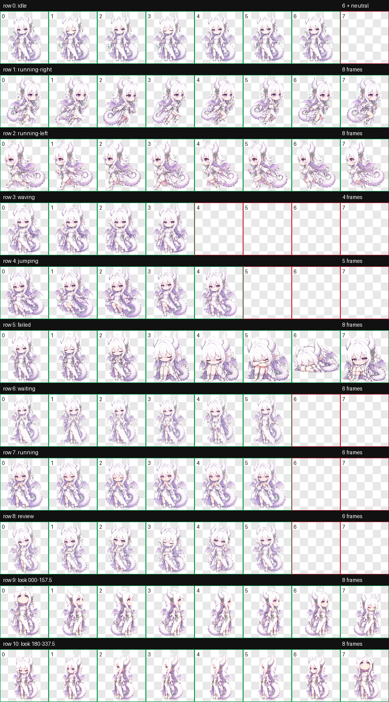

# 霜璃 · Codex 动态宠物

一只白发紫瞳、带双角、小翼与蓬松鳞尾的 Q 版龙族少女宠物。



## 特性

- Codex 宠物图集格式 v2（`spriteVersionNumber: 2`）
- 9 组标准动画：待机、左右移动、挥手、跳跃、失败、等待、工作中、复核
- 16 个观察方向，覆盖上、下、左、右及中间方向
- 透明 WebP 图集，单格 `192 × 208`，完整图集 `1536 × 2288`
- 不依赖脚本、运行库或构建工具

## 最简单的安装方法（Windows）

1. 点击 GitHub 页面右上方 **Code → Download ZIP**。
2. 解压下载文件。
3. 打开 `%USERPROFILE%\.codex\pets\`。
4. 新建文件夹 `shuangli`。
5. 把仓库根目录中的 `pet.json` 和 `spritesheet.webp` 复制到 `shuangli` 文件夹。
6. 重新打开 Codex。

安装完成后的关键目录应为：

```text
%USERPROFILE%\.codex\pets\shuangli\
├── pet.json
└── spritesheet.webp
```

如果已经安装 Git，也可以直接运行：

```powershell
git clone https://github.com/liangjie78/shuangli-codex-pet.git "$env:USERPROFILE\.codex\pets\shuangli"
```

> 该安装方式适用于支持本地 v2 宠物包的 Codex 桌面环境。仓库中的预览图片、GIF 和验证文件不是运行必需文件。

## 动画预览

| 待机 | 左右移动 | 挥手 | 跳跃 |
| --- | --- | --- | --- |
|  |  |  |  |

| 失败 | 等待 | 工作中 | 复核 |
| --- | --- | --- | --- |
|  |  |  |  |

完整的 16 向观察效果见 [方向预览图](assets/look-directions.png)。

## 文件说明

```text
.
├── pet.json                 # Codex 宠物配置
├── spritesheet.webp         # 实际运行图集
├── validation.json          # v2 图集验证结果
├── SHA256SUMS.txt           # 图集完整性校验值
├── assets/                  # 静态总览与方向预览
└── previews/                # 9 组动画 GIF
```

## 常见问题

**Codex 中没有出现宠物？**

检查 `pet.json` 和 `spritesheet.webp` 是否直接位于 `shuangli` 文件夹中，而不是多嵌套了一层仓库目录；然后重新打开 Codex。

**可以只下载两个文件吗？**

可以。运行时只需要仓库根目录的 `pet.json` 和 `spritesheet.webp`。

**怎样验证图集没有损坏？**

PowerShell 中运行：

```powershell
(Get-FileHash .\spritesheet.webp -Algorithm SHA256).Hash
```

结果应与 `SHA256SUMS.txt` 中的值一致。

## 素材与权利说明

本仓库包含根据用户提供的角色参考图生成的派生宠物素材。仓库公开访问不代表授予商业使用、再授权或角色权利；使用时请尊重原始图片作者与相关权利人的权益。

仓库未附带开源许可证，因此除 GitHub 正常浏览、下载和个人安装外，不默认授予其他许可。

## 相关链接

- [OpenAI Codex 官方介绍与安装](https://learn.chatgpt.com/zh-Hans/docs/codex/cli)

